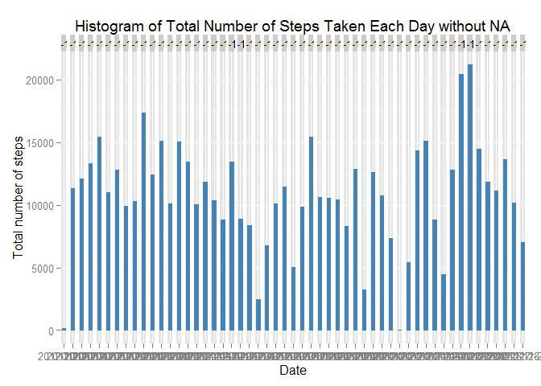
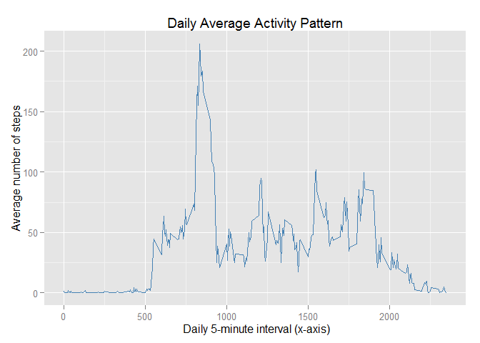
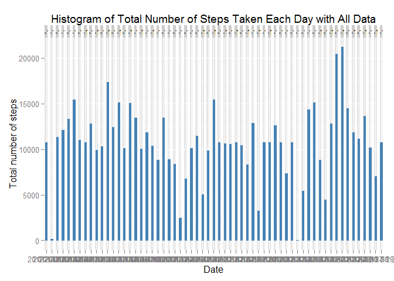
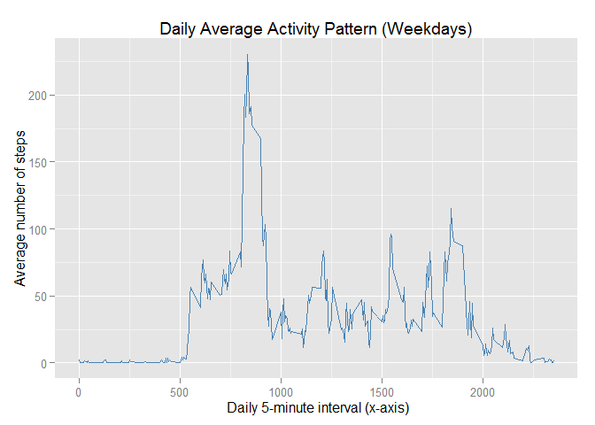
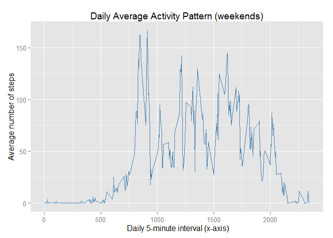

# Reproducible Research: Peer Assessment 1
## Basic Setting

```
## Loading required package: ggplot2
```
## Loading and preprocessing the data


```r
#temp_file <- tempfile()
#dataURL <- "https://d396qusza40orc.cloudfront.net/repdata%2Fdata%2Factivity.zip"
#download.file(dataURL, temp_file)
#unzip(temp_file,"activity.csv")
setwd("E:/DataScience/Reproducible Research Project 1/")
data <- read.csv("./activity.csv", header=T)
data_narm <- na.omit(data)
head(data_narm)
```

```
##     steps       date interval
## 289     0 2012-10-02        0
## 290     0 2012-10-02        5
## 291     0 2012-10-02       10
## 292     0 2012-10-02       15
## 293     0 2012-10-02       20
## 294     0 2012-10-02       25
```
## What is mean total number of steps taken per day?

```r
Total_by_date <- aggregate(data_narm$steps, list(Date = data_narm$date), 
                           FUN="sum")
```


```r
ggplot(data_narm, aes(date,steps)) + geom_bar(stat = "identity", 
colour = "steelblue", fill = "steelblue", width = 0.7) + 
facet_grid(. ~ date, scales = "free") + 
labs(title = "Histogram of Total Number of Steps Taken Each Day without NA", 
x = "Date", y = "Total number of steps")
```

 


```r
mean(Total_by_date$x)
```

```
## [1] 10766.19
```

```r
median(Total_by_date$x)
```

```
## [1] 10765
```
## What is the average daily activity pattern?

```r
Daily_ave <- aggregate(data_narm$steps, list(interval = data_narm$interval), 
                      FUN="mean")
```


```r
ggplot(Daily_ave, aes(interval,x)) + 
geom_line(colour = "steelblue", width = 0.7) + 
labs(title = "Daily Average Activity Pattern", 
x = " Daily 5-minute interval (x-axis)", y = "Average number of steps")
```

 


```r
maxavginterval = Daily_ave$interval[Daily_ave$x == max(Daily_ave$x)]
print(sprintf("Daily 5-min time Interval with maximum average steps taken : %i "
, maxavginterval))
```

```
## [1] "Daily 5-min time Interval with maximum average steps taken : 835 "
```
## Imputing missing values


```r
t_row <- nrow(data)
t_row_narm <- nrow(data_narm)
t_row_na <- t_row-t_row_narm
print(sprintf("We have %i rows of NA data", t_row_na))
```

```
## [1] "We have 2304 rows of NA data"
```


```r
data_to_fill <- data
names(Daily_ave)[2] <- "ave_steps"

for(i in 1:t_row){
  if(is.na(data_to_fill$steps[i])){
    data_to_fill$steps[i] <- Daily_ave[which(data_to_fill$interval[i]==
                                               Daily_ave$interval),]$ave_steps
  }
}

head(data_to_fill)
```

```
##       steps       date interval
## 1 1.7169811 2012-10-01        0
## 2 0.3396226 2012-10-01        5
## 3 0.1320755 2012-10-01       10
## 4 0.1509434 2012-10-01       15
## 5 0.0754717 2012-10-01       20
## 6 2.0943396 2012-10-01       25
```


```r
ggplot(data_to_fill, aes(date,steps)) + geom_bar(stat = "identity", 
colour = "steelblue", fill = "steelblue", width = 0.7) + 
facet_grid(. ~ date, scales = "free") + 
labs(title = "Histogram of Total Number of Steps Taken Each Day with All Data", 
x = "Date", y = "Total number of steps")
```

 

## Are there differences in activity patterns between weekdays and weekends?

```r
new <- data_to_fill
new$date <- as.Date(new$date, "%Y-%m-%d")
new$weekdays <- "weekday"
new$weekdays[weekdays(new$date) %in% c("Saturday")] <- "weekend"
new$weekdays[weekdays(new$date) %in% c("Sunday")] <- "weekend"
new$week <- as.factor(new$weekdays)
```

```r
new_ave <- aggregate(new$steps, list(interval = as.numeric(new$interval),
            weekdays=new$weekdays), FUN="mean")

names(new_ave)[3] <- "ave_step"
head(new_ave)
```

```
##   interval weekdays   ave_step
## 1        0  weekday 2.25115304
## 2        5  weekday 0.44528302
## 3       10  weekday 0.17316562
## 4       15  weekday 0.19790356
## 5       20  weekday 0.09895178
## 6       25  weekday 1.59035639
```


```r
ggplot(new_ave[1:nrow(new_ave)/2,], aes(interval,ave_step)) + 
geom_line(colour = "steelblue", width = 0.7) + 
labs(title = "Daily Average Activity Pattern (Weekdays)", 
x = " Daily 5-minute interval (x-axis)", y = "Average number of steps")
```

 


```r
ggplot(new_ave[(nrow(new_ave)/2+1):nrow(new_ave),], aes(interval,ave_step)) + 
geom_line(colour = "steelblue", width = 0.7) + 
labs(title = "Daily Average Activity Pattern (weekends)", 
x = " Daily 5-minute interval (x-axis)", y = "Average number of steps")
```

 
